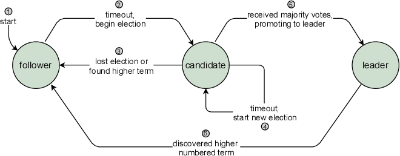
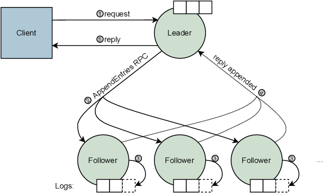

.. include:: substitutions.rst

Distributed Consensus Algorithms: Paxos and Raft
=========================================

Background and Related Work
~~~~~~~~~~~~~~~~~~~~~~~~~~~~~~

The consensus problem requires a set of processes to choose a single value among different proposed values. This
problem is fundamental in distributed systems, enabling processes to agree on a common decision despite failures.
The safety requirements [Lamport2001]_ for consensus are  :

- Only a value that has been proposed may be chosen,
- Only a single value is chosen, and
- A process never learns that a value has been chosen unless it actually has been.

These criteria should be met in scenarios where agents can function at varying speeds, are prone to failure by halting, and where message delivery may encounter delays, duplication, or loss.

The Paxos and Raft algorithms discussed in this document are designed to manage crash failures, where a process halts unexpectedly. However, they do not account for Byzantine failures, where a process might display unpredictable behavior.

Distributed Algorithm: |paxos|
~~~~~~~~~~~~~~~~~~~~~~~~~~~~~~~~~~~~~~~~~~~~~~~~~~~~~~~~~~~~~~~~~~~~~~~~~~~~~~~~~~~~~~~~~~~~~~~~~~~~~~~

Paxos algorithm, introduced by Leslie Lamport [Lamport1998], is a well-known solution to the consensus
problem. It provides a robust solution in distributed systems. System agents can play multiple roles in Paxos; proposers,
acceptors, and learners. The algorithm operates in three phases: prepare, accept, and learn.

In the prepare phase, a proposer picks a number and asks most of the acceptors if they’re ready to accept a proposal.
When an acceptor gets this request, it checks if the number in the request is higher than any it’s seen before. If it is, the
acceptor promises not to accept any lower numbers and tells the proposer the highest number it has accepted so far.

If most acceptors agree, the proposer moves to the next step. It asks all acceptors to accept the proposal. Once most
accept, the proposer tells everyone, and the decision is final. If an acceptor agrees to a proposal number, it accepts it
unless it already responded to a prepare request with a higher number.

Workflow for the algorithm [Xiong2022]_ is provided below:

.. image:: figures/PaxosWorkflow.png
  :width: 600
  :alt: Paxos Workflow

1.3.2.1 Safety
-----------
We can prove Paxos safety by showing that it satisfies the three safety properties mentioned above :

- It ensures acceptors only vote for values that have been proposed by the proposers. So, the first safety property is satisfied.
- If there are 2k+1 acceptors, then at least k+1 acceptors must vote for a value to satisfy the quorum. Since only one quorum can be formed, only one value can be chosen.
- Learners can receive a value to learn only if it has been voted by a quorum of acceptors.

1.3.2.2 Liveness
-----------
If more than one proposer starts off new rounds concurrently, the algorithm may not make progress. Because of that, progress can not be guaranteed in standard Paxos, even if the number of failures is less than half the total number of agents. But if a single proposer is used by utilizing a leader election mechanism which makes multiple proposers elect a single leader, the algorithm is definitely end up choosing a value given enough time and no more than half of the agents fail.

1.3.2.3 Complexity
-----------

In a single Paxos round, every node participates in both the Prepare (Phase 1) and Accept (Phase 2) stages. Throughout these phases, proposers interact with acceptors by transmitting propose and accept messages, while acceptors reply with promise and accepted messages. Hence, each of these 2 phases requires 2 messages per node.

Once a quorum of acceptors has been reached and a decision is reached, the proposer disseminates this decision to all nodes within the system, considering them as potential learners. Learn phase ensures that all nodes ultimately become aware of the determined value, thereby concluding the consensus process.

As a result, the number of messages exchanged per Paxos round is roughly 5N, where N denotes the total number of nodes in the system.

Distributed Algorithm: Raft
~~~~~~~~~~~~~~~~~~~~~~~~~~~~~~~~~~~~~~~~~~~~~~~~~~~~~~~~~~~~~~~~~~~~~~~~~~~~~~~~~~~~~~~~~~~~~~~~~~~~~~~
Raft was created as a response to the complexities inherent in Paxos. Its goal is to be more comprehensible and simpler to implement compared to Paxos. [OngaroAndOusterhout2014]_

It possesses the same fault-tolerance capabilities as Paxos but achieves them through a simpler and more prescriptive approach. Raft divides the consensus problem into more manageable subproblems, which are relatively independent. Moreover, it fills in the gaps in Paxos, that were left to the implementer to figure out.

Raft makes sure that only one chosen leader talks to clients at a time. Nodes can be in one of three roles: leader, follower, or candidate. The leader handles the log and copies it to followers. Followers mostly just listen to the leader's instructions. Candidates are nodes trying to become the leader.

In Raft, it's made sure that the leader always knows the latest log updates. If a follower has newer log entries than the leader, it won't accept the leader's log updates. In this case, the leader steps down, and another candidate with better logs becomes the new leader.

When the leader receives a request from a client, it adds it to its log and shares it with its followers. The followers then add the entry to their logs and confirm back to the leader. Once the leader reaches a quorum of followers, it commits the entry to the log, notifies followers and informs the client.

Raft leader election protocol and log replication mechanism are given in figures obtained from [Brun2021]_ below:

1.3.3.1 Safety
-----------
Present safety proof.

1.3.3.2 Liveness
-----------
Present liveness proof.

1.3.3.3 Complexity
-----------
Present theoretic complexity results in terms of number of messages and computational complexity.

.. [Lamport1998] Leslie Lamport, KThe part-time parliament. ACM Trans. Comput. Syst. 1998, 16, 133–169.
.. [Lamport2001] Lamport, Leslie. (2001). Paxos Made Simple. Sigact News - SIGACT. 32.
.. [Xiong2022] Xiong, Huanliang & Chen, Muxi & Wu, Canghai & Zhao, Yingding & Yi, Wenlong. (2022). Research on Progress of Blockchain Consensus Algorithm: A Review on Recent Progress of Blockchain Consensus Algorithms. Future Internet. 14. 47.
.. [OngaroAndOusterhout2014] Diego Ongaro and John Ousterhout. 2014. In search of an understandable consensus algorithm. In Proceedings of the 2014 USENIX conference on USENIX Annual Technical Conference (USENIX ATC'14). USENIX Association, USA, 305–320.
.. [Brun2021] Le Brun, M.A., Attard, D.P., & Francalanza, A. (2021). Graft: general purpose raft consensus in Elixir. Proceedings of the 20th ACM SIGPLAN International Workshop on Erlang.