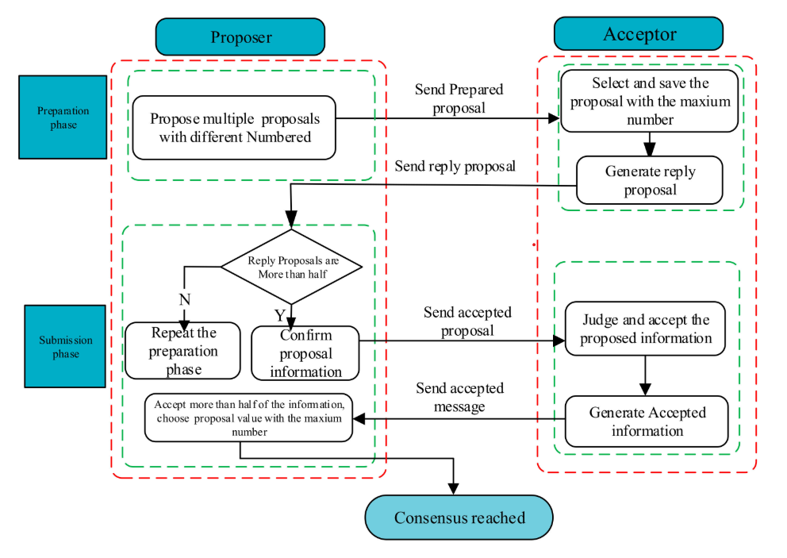

.. include:: substitutions.rst

|paxos|
=========================================

Background and Related Work
~~~~~~~~~~~~~~~~~~~~~~~~~~~~~~

The consensus problem requires a set of processes to choose a single value among different proposed values. This problem is fundamental in distributed systems, enabling processes to agree on a common decision despite failures. The Paxos algorithm, introduced by Leslie Lamport in 1998, is a well-known solution to the consensus problem [Lamport1998]_. The safety requirements for consensus are [Lamport2001]_ :
• Only a value that has been proposed may be chosen,
• Only a single value is chosen, and
• A process never learns that a value has been chosen unless it actually has been.

These criteria should be met in scenarios where agents can function at varying speeds, are prone to failure by halting, and where message delivery may encounter delays, duplication, or loss.

Distributed Algorithm: |paxos|
~~~~~~~~~~~~~~~~~~~~~~~~~~~~~~~~~~~~~~~~~~~~~~~~~~~~~~~~~~~~~~~~~~~~~~~~~~~~~~~~~~~~~~~~~~~~~~~~~~~~~~~

Paxos is one of the most well-known consensus algorithms, providing a robust solution to the consensus problem in distributed systems. System agents can play multiple roles in Paxos; proposers, acceptors, and learners. The algorithm operates in three phases: prepare, accept, and learn.
In the prepare phase, a proposer picks a number and asks most of the acceptors if they're ready to accept a proposal. When an acceptor gets this request, it checks if the number in the request is higher than any it's seen before. If it is, the acceptor promises not to accept any lower numbers and tells the proposer the highest number it has accepted so far.
If most acceptors agree, the proposer moves to the next step. It asks all acceptors to accept the proposal. Once most accept, the proposer tells everyone, and the decision is final. If an acceptor agrees to a proposal number, it accepts it unless it already responded to a prepare request with a higher number.
Workflow for the algorithm [Xiong2022]_ is provided below:

Correctness
~~~~~~~~~~~

Present Correctness, safety, liveness and fairness proofs.

Complexity 
~~~~~~~~~~

Present theoretic complexity results in terms of number of messages and computational complexity.

.. [Lamport1998] Leslie Lamport, KThe part-time parliament. ACM Trans. Comput. Syst. 1998, 16, 133–169.
.. [Lamport2001] Lamport, Leslie. (2001). Paxos Made Simple. Sigact News - SIGACT. 32.
.. [Xiong2022] Xiong, Huanliang & Chen, Muxi & Wu, Canghai & Zhao, Yingding & Yi, Wenlong. (2022). Research on Progress of Blockchain Consensus Algorithm: A Review on Recent Progress of Blockchain Consensus Algorithms. Future Internet. 14. 47.