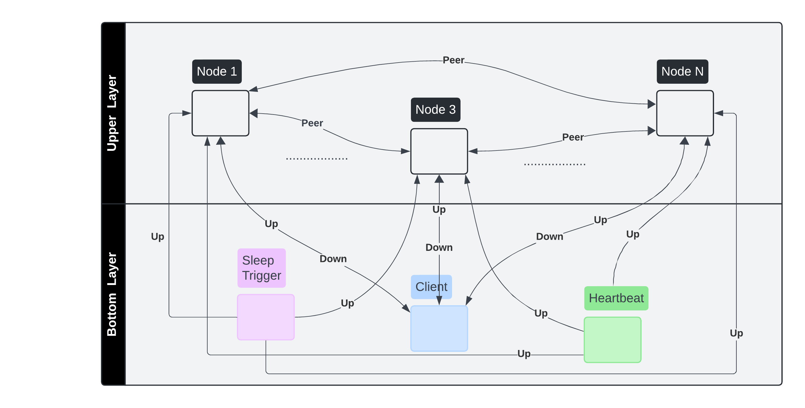

.. include:: substitutions.rst

Implementation, Results and Discussion
======================================

Implementation and Methodology
~~~~~~~~~~~~~~~~~~~~~~~~~~~~~~~~~~~~

There are two layers in the implementation of Ad Hoc Computing System (AHCv2), for experiments.

The upper layer is the involves actual nodes participating in distributed consensus module, and they all run the same code.
Each of these nodes is a separate process, and connected to each other as PEERs.
Also, each node in this layer is connected to the Client Node in lower layer, by a DOWN connector.

The second layer, which is at bottom, involves other nodes to simulate system behavior of a real-world system.
There are 3 nodes in this layer, and they are connected to the upper layer nodes by UP connectors.

Composition of components in the AHCv2 system, is shown in the :ref:`figure <AdhocLayersLabel>` below.

.. _AdhocLayersLabel:

Behavior of consensus nodes have already been discussed in the previous section.
In this section, we will explain the reasoning behind the design of the lower layer nodes.

Client Node
-----------
A client node is a node that sends a request to the system, and waits for a response.
In order to simulate a real-world system, we need to have a client node that sends requests.
In this implementation, one client node is used, and it sends requests to the system at given constant intervals.
With the initialization of the system, the client node starts sending requests to the system.
After first request, it waits for a response from the system, and then sends the next request.
In order to arrange the intervals between requests, it sleeps for a given time after obtaining a response from the system.
New requests are not created until a response for the last request is received.
Even if request could not be successfully processed somehow, newly elected leader node triggers client such that it can send its last request again.
This is done to simulate a real-world system, where a client can send a request again and again if it could not get a response from the system.
Commands in client requests are randomly generated, and they are sent to the system as a string.
To be able to make a sanity check, client node also keeps a copy of the last state of the system, which is obtained by applying all commands sent in correct order.
At the end of all experiments, client's state and nodes' last states were compared to check if the system is consistent.

Heartbeat Node
-----------
As explained in section 1.3, heartbeat has to be taken from leader periodically to believe it is still alive. Normally, followers
keep track of their timeout with another thread, and if they do not receive any heartbeat from leader in a given time, they start an election.
Since nodes in our experiment have only one thread, we need to simulate this behavior with a separate node.
A constant is defined for the heartbeat interval, and it is used to send heartbeat messages to all nodes in upper layer.
According to their states, heartbeat messages are handled differently by the nodes. If a node is a leader, it sends heartbeat messages to all nodes in the system.
Other nodes reset their timeout when they take heartbeat messages from the leader.
Also, followers use heartbeat messages directly to calculate their timeouts.
When a heartbeat from lower layer is received, followers check whether they reached their timeout which means they should be a candidate.
Similarly, candidates have their own timeouts to check whether their election is successful or not.

Sleep Trigger Node
-----------
For the simulation of failures in the system, a sleep trigger node is used. This node randomly selects some nodes from
the upper layer, and sends a sleep message to them. When a node receives a sleep message, it sleeps for a given time.
Sleep time, sleep interval and the number of nodes to be selected are defined as constants.
Using boolean constants, it is possible to involve or exclude leaders from the nodes to be selected to sleep.
When a node wakes up, it continues its operation as if nothing happened. Normally nodes can recover from persistent data in their logs.
Since our nodes only sleep for a given time while they are preserving their logs, they can recover from the sleep without any problem.
After that, they continue their operation as followers and act according to the consensus algorithm to update their logs to the latest state.

Results
~~~~~~~~

For both algorithms, the system is tested with different number of nodes, different sleep times, frequencies and intervals, timeouts and heartbeat intervals.
Meaningful things to evaluate can be summarized as correctness of the system, complexity and performance (time to select a new leader after failure).

Among different parameter choices, harder ones are repeated mostly to be able to see full consistency of the system.
Most of the experiments were performed in the scenario where the largest number of nodes received failures.
That is exactly k faulty nodes, where 2k + 1 is the total number of nodes in the system.
And previous leader is included in the faulty nodes most of the time to see how the system can recover from a failure in the leader node.
There are 2 parameters defining frequency of failures in the system, which are sleep interval and sleep time.
All serious experiments were made with 1.1 seconds sleep interval and 1 second sleep time, which means that each new set of nodes are selected and sleep for 1 second in every 1.1 seconds.
In other words, system had a maximum amount of failures in 90% of the time. As explained before,
system is only dependable when most of the nodes are non-faulty,
and that 0.1 seconds margin has always been enough for the system to recover from failures.
It was hard to synchronize the system with a smaller margin, since there could be some slowness and number of non-faulty nodes could be lower than majority,
which is not supported by algorithms' safety properties.

After repeating the experiments, node count found to be irrelevant for all different aspects of evaluation.
5, 9 and 13 nodes are tested repeatedly, and no significant difference is observed between them.
More than 13 nodes are not tested since it is not expected to have a significant difference and also it does not make sense to have a system with more than 13 nodes in a real-world scenario.

Considering all this general rules and parameters, results are as follows for different aspects of evaluation:

Correctness
-----------
System has always been consistent in all experiments.
It was checked by comparing the last state of all nodes and the client node.
All non-faulty nodes that reaches end of experiment had applied all commands in the same order, and they had the same state.

Performance (complexity)
-----------
Results were consistent with theoretical expectations.
In the experiments, the system has always reached consensus in O(n) time, where n is the number of nodes in the system.
To be more precise, each round required 5n time, 2n for election and 3n for consensus.

Another performance observation that can be expressed in terms of complexity is number of messages needed to recover from failure of each node.
In the experiments, each node required 2m additional messages to recover from failure, where m is the number of entries appended to the log while the node was in failure.
These complexity numbers are valid for both algorithms, which are equal in terms of performance.

Only additional complexity that can be observed was in terms of space, and occur during the election of a newly failed leader in Paxos.
As explained in the previous sections, Raft does not allow nodes that are not up-to-date to be elected as leader.
But Paxos does not have such a restriction, and failed nodes can be leaders even if they are not up-to-date, by taking missing log entries from other nodes during the election.
This additional complexity is not quantified, but has been observed to be consistent with theory. Failed candidates takes m messages from other nodes to be elected as leader,
which makes bodies of promise messages this much larger than Raft's messages. It was not quantified because it was directly
related to number of missing entries, in other words sleep time, which is only a parameter of the system.

Time to select a leader
-----------
The only measurable time in the system is the time to select a leader.
Because, for all the observations, the system has directly reached to consensus after the leader is selected successfully.
As explained, since this time is not significantly affected by the number of nodes, only results experiments with 5 nodes are shown below.
In addition, in these experiments, 2 nodes, including the leader, were always put to sleep every second to refresh the leader election and take an average time to select a new leader.
In the grapgs given below, x axis represents the smallest timeout in ms for nodes, and y axis represents the time to select a new leader in ms.
For Paxos, the smallest timeout is also the timeout for all nodes, since it is a constant.
But for Raft, the timeouts are different for each node, and diff is the difference between the timeouts of nodes.
For example for smallest timeout 150 and diff 20, timeouts of nodes are 150, 170, 190, 210 and 230 ms.
HB is the heartbeat interval, which is also a constant for all nodes in the system, for both algorithms.

In the :ref:`first graph <SmallGraphLabel>`, we can see 3 different cases for Raft, where diff is 5 and 20, while HB is 10 and 100 ms.
There is also a Paxos estimation, it is not repeated since diff is not a parameter for it, and HB does not affect the time to select a new leader.

.. _SmallGraphLabel:

.. image:: figures/SmallGraph.png
  :width: 250
  :alt: Time to Select a New Leader for Raft and Paxos with Different Timeouts

In the :ref:`second graph <LargeGraphLabel>`, we can see that one more case is added to the previous cases, where diff is 0 for Raft.

.. _LargeGraphLabel:

.. image:: figures/LargeGraph.png
  :width: 250
  :alt: Time to Select a New Leader for Raft and Paxos with Different Timeouts - Extended

Discussion
~~~~~~~~~~

As a result, as explained above, the two algorithms are consistent and do not differ in terms of safety,
and there is no difference in the number of messages required to reach consensus.

In terms of performance, two algorithms are also consistent with the theoretical expectations, and they have a
difference only for the time to select a new leader and message sizes sent during election after leader failure.
Discussion will focus on performance in this sense and we will also comment on Raft's main argument for simplicity based on the observations made.

Performance
-----------
In Paxos, the time to select a new leader is nearly constant, and it is very close to the timeout of the nodes.
It is because, in Paxos, when multiple nodes start an election, the one with the highest number is elected as leader.

On the other hand, in Raft, the time to select a new leader is directly related to how the timeouts of the nodes are arranged.
If there are not enough times between the timeouts of the nodes, the system may split votes and time to select a new leader can considerably increase.
We can easily see this in the graphs given above. When the difference between the timeouts of the nodes is 0, the time to select a new leader is the highest.
When the difference is increases to 5, the time to select a new leader decreases, and when it is 20, it decreases even more and gets very close to the time to select a new leader in Paxos.
Another observation can be made considering the redline, which has a high heartbeat interval.
When the heartbeat interval is high, the time to select a new leader is also high as much as it is closer to the heartbeat interval.
This effect may not be such dramatic in real time environments, since heartbeat here in our simulation makes the system more sensitive to since timeouts are unnecessarily detected at the same time with heartbeat messages.

On the other hand, Raft's leader election is executed with smaller messages in length, since it doesn't need to send extra log entries to candidates
because of limitation that only up-to-date nodes can be elected as leader.

Considering both facts, given timeouts are not very close to each other, Raft's time to select a new leader is very close to Paxos, and it is also more efficient in terms of message length,
making it a better choice for some systems. But there may be some systems that can take advantage of not limiting the leader election with up-to-date nodes, and Paxos can be a better choice for them.

As a result, I would say that they both can be used very efficiently in different systems, and the choice between them should be made according to the requirements of the system.

Understandability
-----------
Raft is claimed to be more understandable than Paxos, and it is also claimed that it is easier to implement.
While I observe that this is certainly true for the first version of Paxos,
I can't say that I agree with it when I consider the ways in which it has been used and developed in practice.
Paxos seems to be as clearly presentable and understandable as Raft.
For this, it was enough to make a few decisions in a similar way to Raft, as I did in my implementation,
and fill in a few things that base Paxos leaves to the implementor. As a result, I consider both algorithms quite similar in terms of understandability.